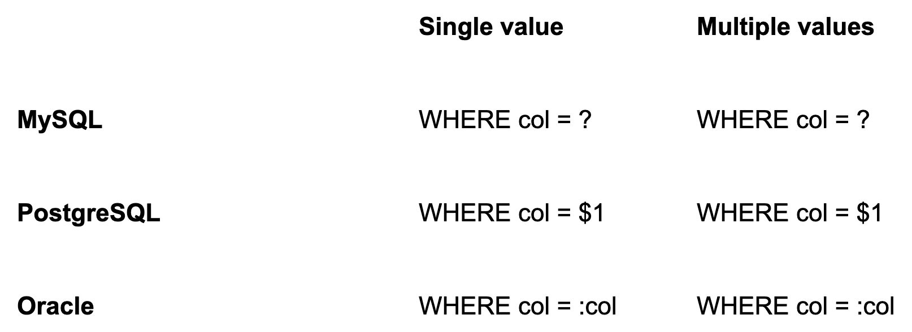

## 函数api

go自带包database/sql提供了sql操作的函数：

| Package      | API                                                          | 功能                                                         |
| ------------ | ------------------------------------------------------------ | ------------------------------------------------------------ |
| database/sql | func (db *DB) Exec(query string, args ...interface{}) (Result, error) | Exec 执行查询而不返回任何行。                                |
| database/sql | func (db *DB) ExecContext(ctx context.Context, query string, args ...interface{}) (Result, error) | ExecContext 执行查询而不返回任何行。                         |
| database/sql | func (db *DB) Query(query string, args ...interface{}) (*Rows, error) | 查询执行一个返回行的查询，通常是一个 SELECT。                |
| database/sql | func (db *DB) QueryContext(ctx context.Context, query string, args ...interface{}) (*Rows, error) | QueryContext 执行一个返回行的查询，通常是一个 SELECT /       |
| database/sql | func (db *DB) QueryRow(query string, args ...interface{}) *Row | QueryRow 执行一个查询，该查询最多只返回一行。QueryRow总是返回一个非零值。 |
| database/sql | func (db *DB) QueryRowContext(ctx context.Context, query string, args ...interface{}) *Row | QueryRowContext 执行一个预计最多只返回一行的查询。QueryRowContext 总是返回一个非零值。 |

一般大家会使用go语言的第三方数据库框架，第三方框架很多，比如`gorm`,beego框架自带的`beego orm`等。

## gorm/xrom

| package | 函数                        |
| ------- | --------------------------- |
| Gorm    | Exec,Raw,Select,Where       |
| xorm    | Query,QueryString,SQL,Where |

## 检测

- 如果使用`database/sql`原生sdk包，直接在源代码中以`\.Exec\(|\.ExecContext\(|\.Query\(|\.QueryContext\(|\.QueryRow\(|\.QueryRowContext\(`等函数名称做关键字进行搜索，然后对这些函数执行的SQL进行排查。
- 如果使用第三方的数据库包，查看对应的sql操作文档，使用关键字在源码中搜索，查看是否做了sql语句进行拼接。例如，使用beego框架的orm，搜索`.Raw`等关键字。


## go sql注入防护

### 在go中使用参数化查询

参数化查询看起来很像普通查询。但并不是使用`字符串格式`(fmt.Sprintf())或`拼接`来组合查询

如：

```go
"select name,email from users where id =?"
```

在这种情况下，?字符是将被发送到数据库引擎的占位符。

占位符本身时特定于数据库的，不同数据库占位符不同：



```go
import (
"database/sql"
 
_ "github.com/lib/pq" 	// 加载postgreSQL驱动
)

func main() {
  // 链接postgreSql数据库
    connStr := "user=pqgotest dbname=pqgotest sslmode=verify-full"
    db, err := sql.Open("postgres", connStr)
    if err != nil {
        log.Fatal(err)
    }

    age := 21
  //使用占位符参数化查询
    rows, err := db.Query("SELECT name FROM users WHERE age = $1", age)
}
```


## 参考：

https://github.com/he1m4n6a/Go_Security_Study/tree/master/%E7%BC%96%E7%A0%81%E5%AE%89%E5%85%A8/WEB%E5%AE%89%E5%85%A8#web

https://www.stackhawk.com/blog/golang-sql-injection-guide-examples-and-prevention/