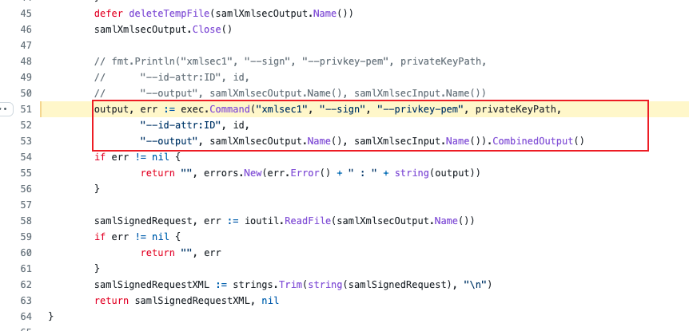

## 函数api

如果用户被允许输入结构化的XML片段，则他可以在XML的数据域中注入XML标签来改写目标XML文档的结构和内容，XML解析器会对注入的标签进行识别和解释，引起注入问题。encoding/xml提供XML编解码能力。

编码函数有：

| API                                                          | 功能                                                         |
| ------------------------------------------------------------ | ------------------------------------------------------------ |
| func Marshal(v interface{}) ([]byte, error)                  | Marshal 返回 v 的 XML 编码。 Marshal 通过封送每个元素来处理数组或片段。Marshal 通过编组指向的值处理指针，如果指针为零，则不写任何内容。 |
| func MarshalIndent(v interface{}, prefix, indent string) ([]byte, error) | MarshalIndent 的工作方式与 Marshal 相同，但每个 XML 元素都以一个新的缩进行开始，该行以前缀开头，后跟一个或多个根据嵌套深度缩进的缩进副本。 |
| func (enc *Encoder) Encode(v interface{}) error              | 编码将 v 的 XML 编码写入流。                                 |
| func NewEncoder(w io.Writer) *Encoder                        | NewDecoder创建一个从r读取的新XML解析器。                     |
| func (enc *Encoder) EncodeElement(v interface{}, start StartElement) error | EncodeElement 将 v 的 XML 编码写入流，使用 start 作为编码中最外层的标记。 |
| func (*Encoder) EncodeToken                                  | EncodeToken 将给定的 XML 令牌写入流中。如果 StartElement 和 EndElement 标记没有正确匹配，它将返回一个错误。 |

解码函数：

| API                                                          | 功能                                                         |
| ------------------------------------------------------------ | ------------------------------------------------------------ |
| func Unmarshal(data []byte, v interface{}) error             | Unmarshal 解析 XML 编码的数据并将结果存储在v指向的值中，该值必须是任意的结构体，切片或字符串。丢弃不适合v的格式良好的数据。 |
| func (d *Decoder) Decode(v interface{}) error                | 解码像 Unmarshal 一样工作，除了它读取解码器流以查找开始元素。 |
| func NewDecoder(r io.Reader) *Decoder                        | NewDecoder 从 r 中创建一个新的 XML 分析器。如果 r 没有实现 io.ByteReader，NewDecoder 会自行缓冲。 |
| func (d *Decoder) DecodeElement(v interface{}, start *StartElement) error | DecodeElement 的工作方式与 Unmarshal 类似，只不过它需要一个指向开始 XML 元素的指针来解码为 v。当客户端读取一些原始 XML 令牌本身时，它也很有用，但也希望延迟 Unmarshal 的某些元素。 |
| func (d *Decoder) Token() (Token, error)                     | 令牌返回输入流中的下一个XML令牌。在输入流结束时，令牌返回 nil，io.EOF。 |
| func (d *Decoder) RawToken() (Token, error)                  | RawToken 与 Token 类似，但不验证开始和结束元素是否匹配，也不会将名称空间前缀转换为相应的 URL。 |

go语言的encoding/xml包实现了一个简单的XML 1.0 解析器，该解析器不会处理DTD声明实体，**不存在XXE漏洞。** 但第三方库可能引入xxe漏洞，例如[RobotsAndPencils/go-saml/](https://github.com/RobotsAndPencils/go-saml/issues/14)库。

## 检测：

- 查看代码import中是否有encoding/xml包，如果有，再进一步判断是否字符串拼接XML语句，存在拼接XML语句，则可能存在注入。
- 查看代码import中是否存在go-saml 包，如果有，再进一步判断是否引入了外部实体，如果引入则可能存在xxe漏洞。

## go-saml库导致的xxe

项目地址：https://github.com/RobotsAndPencils/go-saml

漏洞描述：https://github.com/RobotsAndPencils/go-saml/issues/14

漏洞原因：

go-saml的xml解析采用xmlsec1进行解析。

xmlsec低版本解析xml文件会访问外部dtd实体，可能产生xxe。

## 参考：

https://github.com/he1m4n6a/Go_Security_Study/tree/master/%E7%BC%96%E7%A0%81%E5%AE%89%E5%85%A8/WEB%E5%AE%89%E5%85%A8#web

