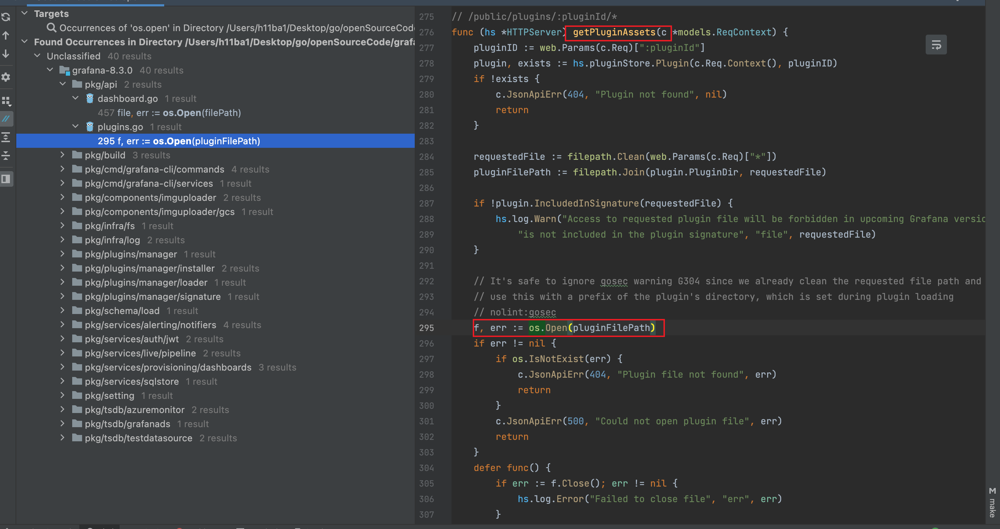
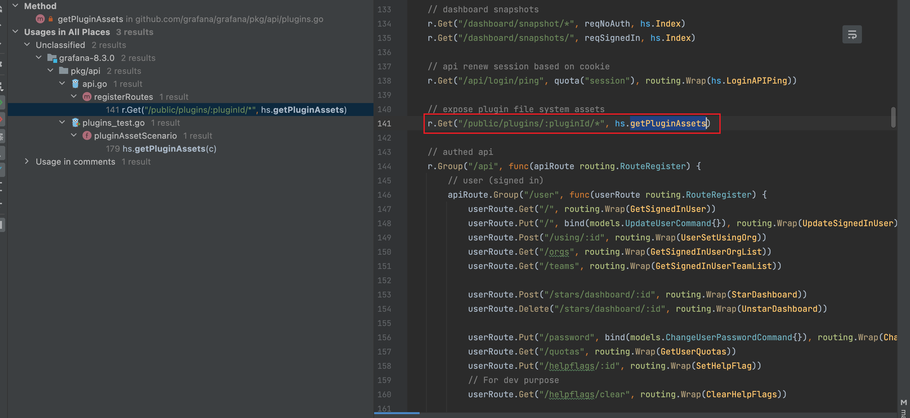
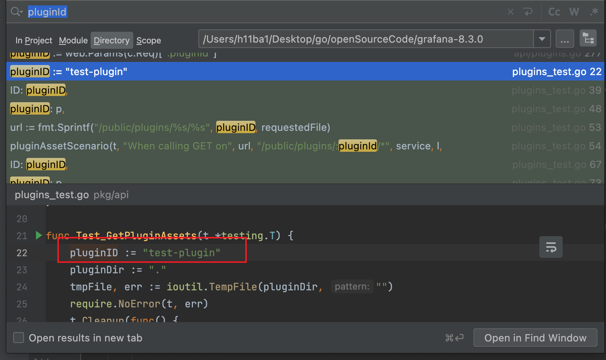
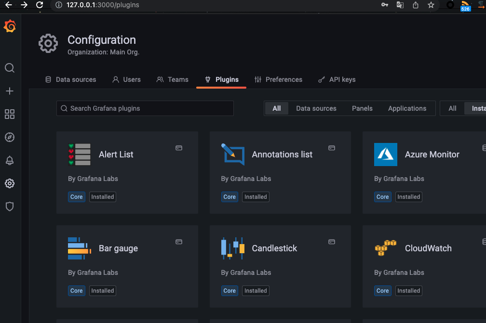
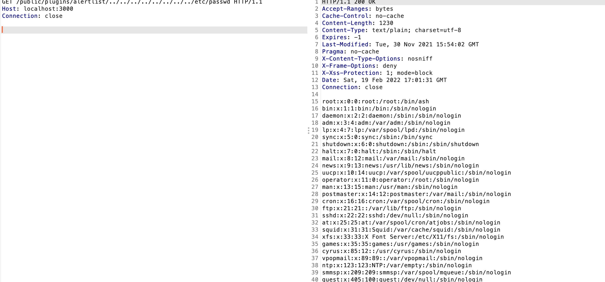

Checklist：
该漏洞是一个未授权访问+os.Open()函数未限制导致的任意文件读取漏洞。


这里使用grafana-8.3.0进行审计复现。

这个漏洞是一个未授权任意文件读取，和插件有关。

## 全局搜索os.Open。



发现getPluginAssets就很像。

option+F7查看全局使用getPluginAssets()的代码：



/public/public/:pluginId/*路由就调用了，getPluginAssets。且没有reqSignedIn等登陆认真字段。

那么就可以确定是这里了。

## 构造路由

```
/public/plugins/:pluginId/*
```

全局搜索pluginId可发现一个测试用例：


可以确定pluginId就是插件名，那么只要找到一个插件名就可以了。

进入插件目录：


使用第一个插件进行尝试：




在实际渗透中，可尝试请求默认安装的插件。或fuzz.