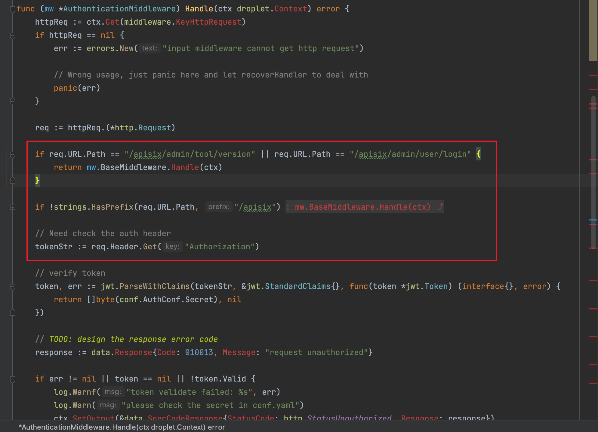
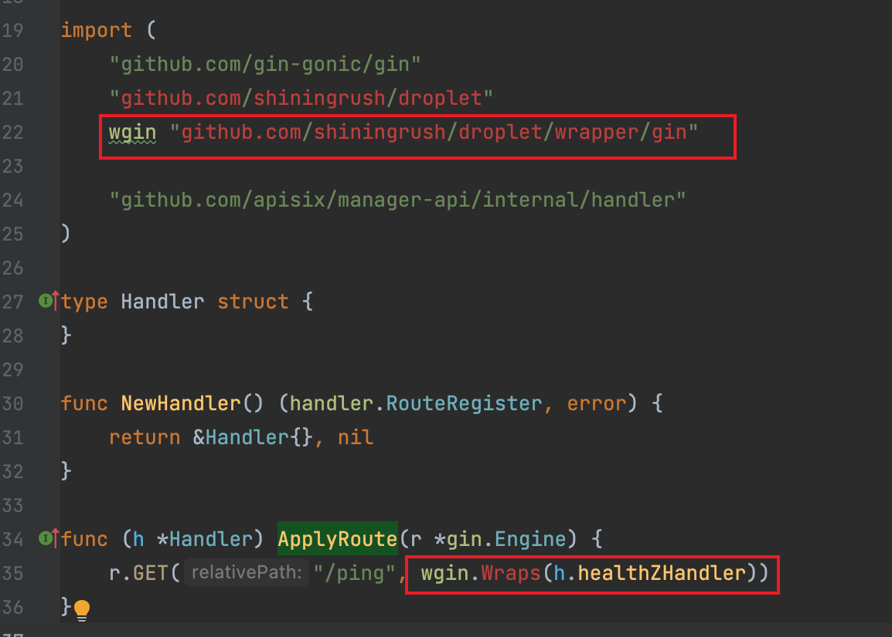
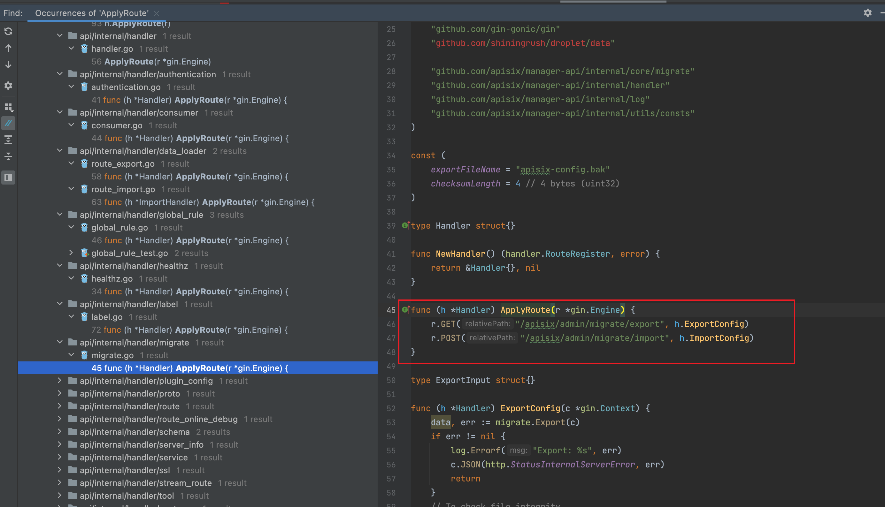
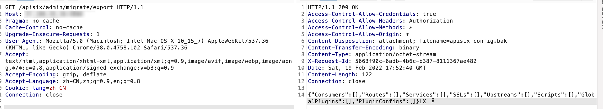
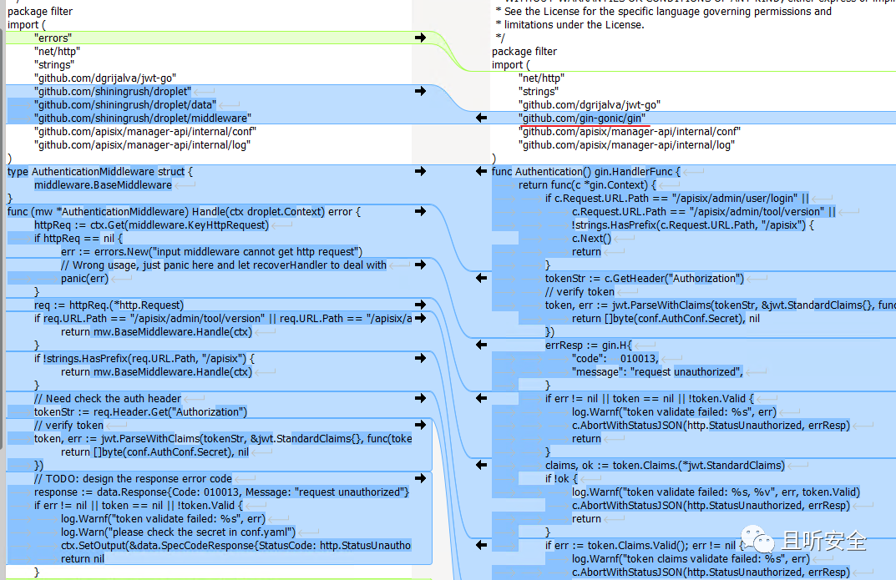

Checklist:
api未设置权限认证导致的未授权访问漏洞。

分析该类漏洞时，可先查看项目使用的认证方式，查找没有进行认证的路由。

## 简介

影响版本：v2.7-2.10

Apache APISIX 是一个动态、实时、高性能的 API 网关，Apache APISIX Dashboard 使用户可通过前端界面操作 Apache APISIX。


## 环境搭建

安装apisix之前需要先安装bitnami/etcd

```shell
docker run -it --name etcd-server -p 2379:2379 -p 2380:2380 --env ALLOW_NONE_AUTHENTICATION=yes -d bitnami/etcd
```

然后创建apish 配置文件conf.yaml

```yaml
conf:
  listen:
    host: 0.0.0.0         # the address on which the `Manager API` should listen.
                          # The default value is 0.0.0.0, if want to specify, please enable it.
                          # This value accepts IPv4, IPv6, and hostname.
    port: 9000            # The port on which the `Manager API` should listen.

  allow_list:             # If we don't set any IP list, then any IP access is allowed by default.
  etcd:
    endpoints:            # supports defining multiple etcd host addresses for an etcd cluster
      - x.x.x.x:2379			#需要换本机ip
authentication:
  secret:
    zQ5w5jkLDh3jZpywJ3sskrw6Yv633ruq
  expire_time: 3600     # jwt token expire time, in second
  users:                # yamllint enable rule:comments-indentation
    - username: admin
      password: password
    - username: user
      password: password
```

安装apisix：

```shell
docker run -d -p 9000:9000 -v /root/oss/apisix/conf.yaml:/usr/local/apisix-dashboard/conf/conf.yaml apache/apisix-dashboard:2.9.0
```


## 漏洞分析

apisix使用`droplet`进行鉴权。认证过程如下：



以 `/apisix` 开头的 URL，除了 `/apisix/admin/tool/version` 和 `/apisix/admin/user/login` 以外均需要认证，通过判断 HTTP Header 中的 `Authorization` 来完成鉴权处理。




对全局路由分析发现，大多数路由都使用`wgin.Wraps(h.healthZHandler)`进行权限认证。




对全局ApplyRoute搜索发现存在两个api未授权：

```go
func (h *Handler) ApplyRoute(r *gin.Engine) {
	r.GET("/apisix/admin/migrate/export", h.ExportConfig)
	r.POST("/apisix/admin/migrate/import", h.ImportConfig)
}
```


## 漏洞利用



请求`/apisix/admin/migrate/export`未授权访问成功。


## 修复



新版本将框架换成了 `gin-gonic`，所有路由都要走 `Authentication` 进行处理。

## 参考：

https://www.wangan.com/p/7fy747719a2907e1