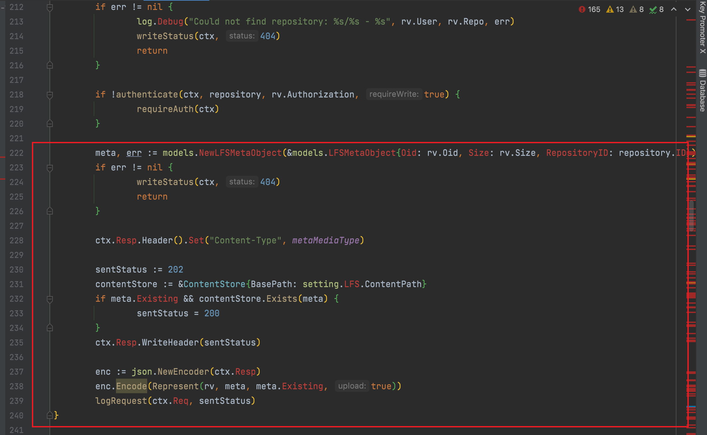

## 权限校验后没有终止代码

开发者在进行权限校验时，校验失败通常会返回一个40X状态码并跳转到一个错误页面。

如果在跳转之后并没有`return/报错`等终止权限校验后的代码流程，就有可能造成未授权访问漏洞。

### 实例：

#### Gitea1.4.0未授权访问漏洞。

modules/lfs/server.go#PostHandler()函数

```go
// PostHandler instructs the client how to upload data
func PostHandler(ctx *context.Context) {
	if !setting.LFS.StartServer {
		writeStatus(ctx, 404)
		return
	}

	if !MetaMatcher(ctx.Req) {
		writeStatus(ctx, 400)
		return
	}

	rv := unpack(ctx)

	repository, err := models.GetRepositoryByOwnerAndName(rv.User, rv.Repo)
	if err != nil {
		log.Debug("Could not find repository: %s/%s - %s", rv.User, rv.Repo, err)
		writeStatus(ctx, 404)
		return
	}

	if !authenticate(ctx, repository, rv.Authorization, true) {
		requireAuth(ctx)
    // 此处权限校验之后没有return 结束代码
	}

	meta, err := models.NewLFSMetaObject(&models.LFSMetaObject{Oid: rv.Oid, Size: rv.Size, RepositoryID: repository.ID})
	if err != nil {
		writeStatus(ctx, 404)
		return
	}

	ctx.Resp.Header().Set("Content-Type", metaMediaType)

	sentStatus := 202
	contentStore := &ContentStore{BasePath: setting.LFS.ContentPath}
	if meta.Existing && contentStore.Exists(meta) {
		sentStatus = 200
	}
	ctx.Resp.WriteHeader(sentStatus)

	enc := json.NewEncoder(ctx.Resp)
	enc.Encode(Represent(rv, meta, meta.Existing, true))
	logRequest(ctx.Req, sentStatus)
}
```

权限校验代码：

```go
	if !authenticate(ctx, repository, rv.Authorization, true) {
		requireAuth(ctx)
	}
```

```go
func requireAuth(ctx *context.Context) {
	ctx.Resp.Header().Set("WWW-Authenticate", "Basic realm=gitea-lfs")
	writeStatus(ctx, 401)
}
```

没有授权则进入requireAuth(ctx)函数，添加一个响应头，并返回401。

此时虽然请求会报401，但是`	if !authenticate(ctx, repository, rv.Authorization, true) {}`之后的代码并（return）没有结束，依旧会继续执行。



