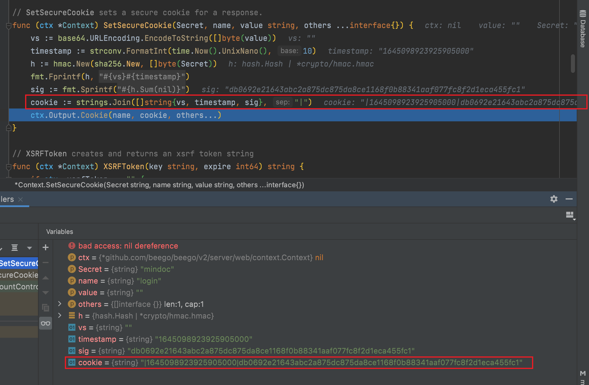

## 1.自生成secureCookie可伪造

一些单独开发的程序，采用自己生成的secureKey存在伪造的风险。可能导致权限绕过。

### 实列：

项目地址：https://github.com/mindoc-org/mindoc

```go
func (ctx *Context) SetSecureCookie(Secret, name, value string, others ...interface{}) {

	vs := base64.URLEncoding.EncodeToString([]byte(value))

	// 当前时间
	timestamp := strconv.FormatInt(time.Now().UnixNano(), 10)

	// sha256
	h := hmac.New(sha256.New, []byte(Secret))

	fmt.Fprintf(h, "%s%s", vs, timestamp)

	// Sum 将当前散列附加到 b 并返回结果切片。它不会改变底层哈希状态。
	sig := fmt.Sprintf("%02x", h.Sum(nil))

	// 组合生成cookie
	cookie := strings.Join([]string{vs, timestamp, sig}, "|")

	ctx.Output.Cookie(name, cookie, others...)
}
//app_key 为Secret ,mindoc。

func GetAppKey() string {
	return web.AppConfig.DefaultString("app_key", "mindoc")
}

接使用就可以构造出login,cookie。感觉很像shiro的RememberMe。
SetSecureCookie("mindoc", "login", v, time.Now().Add(time.Hour*24*30).Unix())
```

通过查看代码获取到Secret等参数，可直接调用程序生成cookie




## 参考链接：

https://forum.butian.net/share/928