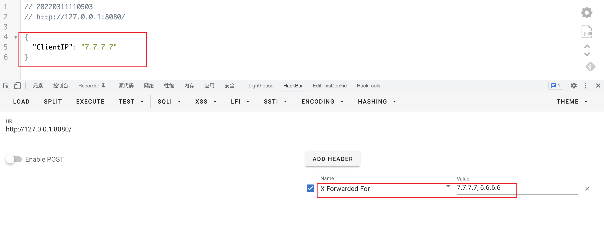
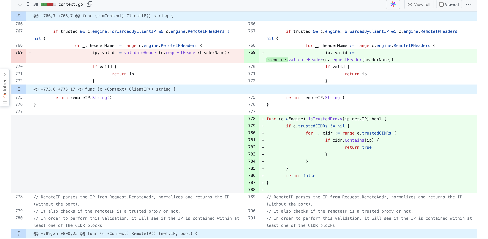

Gin version 1.7.7以下存在一个xff头伪造的漏洞。

该漏洞源于可以通过设置X-Forwarded-For头来欺骗客户端的IP。

github issues:https://github.com/gin-gonic/gin/issues/2862


写一个简单的demo:

```go
func main() {
	// 初始化一个http服务对象
	r := gin.Default()

	// 设置一个get请求的路由，url为/ping, 处理函数（或者叫控制器函数）是一个闭包函数。
	r.GET("/", func(c *gin.Context) {
		// 通过请求上下文对象Context, 直接往客户端返回一个json
		c.JSON(200, gin.H{
			"ClientIP": c.ClientIP(),
		})
	})

	r.Run() // 监听并在 0.0.0.0:8080 上启动服务
}
```

这里gin版本为1.7.6。


进行xff伪造尝试：



修复：

在gin1.7.7版本中进行了修复：

https://github.com/gin-gonic/gin/pull/2844/files#diff-e6ce689a25eaef174c2dd51fe869fabbe04a6c6afbd416b23eda138c82e761baR1432



添加isTrustedProxy来进行严格判断。