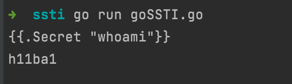

## 从一个ctf题看模版注入rce

```go
package main

import (
	"bufio"
	"html/template"
	"log"
	"os"
	"os/exec"
)

type Program string

func (p Program) Secret(test string)string  {
	out,_ :=exec.Command(test).CombinedOutput()
	return string(out)
}

func (p Program) Label(test string)string {
	return "This is "+string(test)
}

func main()  {
	// 处理终端输入为一个reader
	reader := bufio.NewReader(os.Stdin)
	/*
	ReadString 读取直到输入中第一次出现 分隔符，返回一个字符串，其中包含直到并包括分隔符的数据。
	如果 ReadString 在找到分隔符之前遇到错误，它会返回错误之前读取的数据和错误本身（通常是 io.EOF）。
	当且仅当返回的数据不以 delim 结尾时，ReadString 才会返回 err != nil。对于简单的使用，扫描仪可能更方便。
	*/
	// 遇到\n结束并返回一个字符串
	text,_:=reader.ReadString('\n')
	// 解析text为tepl模版
	tmpl,err:=template.New("").Parse(text)
	if err!=nil{
		log.Fatalf("Parse: %v", err)
	}
	// Execute 将tmpl模板应用于Program，并将输出写入 os.Stdin。
	tmpl.Execute(os.Stdin,Program("Integrity"))
}
```

一些go 模版常识：

1.模版的占位符为`{{语法}}`,这里的 语法 官方称之为 Action ，其内部不能有换行，但可以写注释，注释里可以有换行。

2.特殊的	`Action:{{.}}`	，中间的点表示当前作用域的当前对象，类似`java`中的`this`关键字。

3.`Action`中支持定义变量，命名以`$`开头,如 `$var = "test"` ,有⼀个⽐较特殊的变量 $ ,代表全局作⽤域的全局变量,即在调⽤模板引擎的 Execute() ⽅法时定义的值,如 `{{$}}` 在上⾯的题⽬中获取到的值就是 `Intigriti `.

4.`Action` 中内置了⼀些基础语法,如常⻅的语法,如判断` if else` ,或且⾮ `or and not `,⼆元⽐较 `eq ne `,输出 `print printf println `等等,除此之外还有⼀些常⽤的编码函数，如 `urlescaper,attrescaper,htmlescaper `。

5.Action 中⽀持类似 unix 下的管道符⽤法, `| `前⾯的命令会将运算结果(或返回值)传递给后⼀个命令的最后⼀个位置。

Payload:



## 漏洞挖掘

### 白盒

- 搜索代码引入的import包中是否包含`html/template|text/template|flosch/pongo2`，如果存在则进一步查看调用的代码上下文是否存在解析外部变量。
- 搜索`{{|}}`关键字，查看是否是模板解析外部变量。

### 黑盒

引擎中⽆⽹络请求相关的⽅法,⽆法通过dnslog/httplog的⽅式盲测漏洞,但其本身⽀持⼀些编码函数,有回显的场景可通过表达式判 断是否存在漏洞。 

payload 如下,执⾏后回显的值为 95272022 

`{{println 0B101101011011011110001010110}} `

rcefuzzer在配置 paramPollution.expr 中加⼀条 payload 即可

` {{println 0B101101011011011110001010110}}|95272022`


## ref

https://wx.zsxq.com/dweb2/index/topic_detail/418582124158158