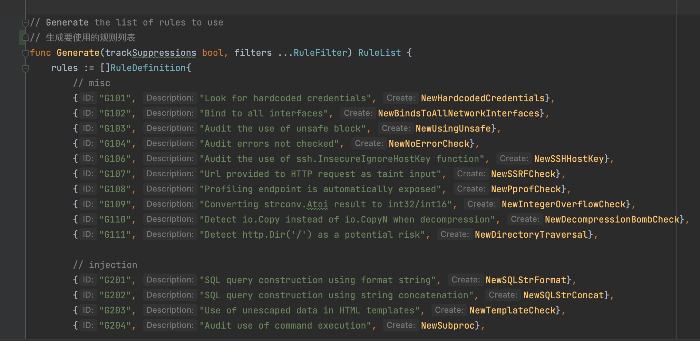

## AST

抽象语法树 (Abstract Syntax Tree)，简称 AST，它是源代码语法结构的一种抽象表示。它以树状的形式表现编程语言的语法结构，树上的每个节点都表示源代码中的一种结构。


## gosec 如何生存ast

主要采用了go/ast,go/parse包。

```go
func main() {
	// src is the input for which we want to print the AST.
	src := `
package main
func main() {
    println("Hello, World!")
}
`
	// Create the AST by parsing src.
	fset := token.NewFileSet() // positions are relative to fset
	f, err := parser.ParseFile(fset, "", src, 0)
	if err != nil {
		panic(err)
	}

	// Print the AST.
	ast.Print(fset, f)
}
```

对输出hello world身材ast语法树的结果：

```go
	Output:
	     0  *ast.File {
	     1  .  Package: 2:1
	     2  .  Name: *ast.Ident {
	     3  .  .  NamePos: 2:9
	     4  .  .  Name: "main"
	     5  .  }
	     6  .  Decls: []ast.Decl (len = 1) {
	     7  .  .  0: *ast.FuncDecl {
	     8  .  .  .  Name: *ast.Ident {
	     9  .  .  .  .  NamePos: 3:6
	    10  .  .  .  .  Name: "main"
	    11  .  .  .  .  Obj: *ast.Object {
	    12  .  .  .  .  .  Kind: func
	    13  .  .  .  .  .  Name: "main"
	    14  .  .  .  .  .  Decl: *(obj @ 7)
	    15  .  .  .  .  }
	    16  .  .  .  }
	    17  .  .  .  Type: *ast.FuncType {
	    18  .  .  .  .  Func: 3:1
	    19  .  .  .  .  Params: *ast.FieldList {
	    20  .  .  .  .  .  Opening: 3:10
	    21  .  .  .  .  .  Closing: 3:11
	    22  .  .  .  .  }
	    23  .  .  .  }
	    24  .  .  .  Body: *ast.BlockStmt {
	    25  .  .  .  .  Lbrace: 3:13
	    26  .  .  .  .  List: []ast.Stmt (len = 1) {
	    27  .  .  .  .  .  0: *ast.ExprStmt {
	    28  .  .  .  .  .  .  X: *ast.CallExpr {
	    29  .  .  .  .  .  .  .  Fun: *ast.Ident {
	    30  .  .  .  .  .  .  .  .  NamePos: 4:2
	    31  .  .  .  .  .  .  .  .  Name: "println"
	    32  .  .  .  .  .  .  .  }
	    33  .  .  .  .  .  .  .  Lparen: 4:9
	    34  .  .  .  .  .  .  .  Args: []ast.Expr (len = 1) {
	    35  .  .  .  .  .  .  .  .  0: *ast.BasicLit {
	    36  .  .  .  .  .  .  .  .  .  ValuePos: 4:10
	    37  .  .  .  .  .  .  .  .  .  Kind: STRING
	    38  .  .  .  .  .  .  .  .  .  Value: "\"Hello, World!\""
	    39  .  .  .  .  .  .  .  .  }
	    40  .  .  .  .  .  .  .  }
	    41  .  .  .  .  .  .  .  Ellipsis: -
	    42  .  .  .  .  .  .  .  Rparen: 4:25
	    43  .  .  .  .  .  .  }
	    44  .  .  .  .  .  }
	    45  .  .  .  .  }
	    46  .  .  .  .  Rbrace: 5:1
	    47  .  .  .  }
	    48  .  .  }
	    49  .  }
	    50  .  Scope: *ast.Scope {
	    51  .  .  Objects: map[string]*ast.Object (len = 1) {
	    52  .  .  .  "main": *(obj @ 11)
	    53  .  .  }
	    54  .  }
	    55  .  Unresolved: []*ast.Ident (len = 1) {
	    56  .  .  0: *(obj @ 29)
	    57  .  }
	    58  }
```

## gosec检测规则自定义

rules/rulelist.go记载了所有规则。

主要包含规则的id，描述，检测机制。

```go
// RuleDefinition 包含规则的描述和创建它的机制。
type RuleDefinition struct {
	ID          string
	Description string
	Create      gosec.RuleBuilder
}
```

规则检测文件主要包含一个Match函数，还有其他的规则函数。




用个文件权限检测规则来举例：

match函数：

```go
// 传入ast节点，
func (r *filePermissions) Match(n ast.Node, c *gosec.Context) (*gosec.Issue, error) {
	// 遍历白名单的包
	for _, pkg := range r.pkgs {
		// 确保导入指定的包，调整任何别名的名称并忽略仅初始化导入的情况。
		// 查找r.calls函数
		if callexpr, matched := gosec.MatchCallByPackage(n, c, pkg, r.calls...); matched {
			// 调用表达式
			// CallExpr 节点表示后跟参数列表的表达式。Args表示函数的参数
			// 函数的最后一个参数
			modeArg := callexpr.Args[len(callexpr.Args)-1]
			// 如果函数参数比预定义参数的大，则说明存在问题
			if mode, err := gosec.GetInt(modeArg); err == nil && mode > r.mode {
				//
				return gosec.NewIssue(c, n, r.ID(), r.What, r.Severity, r.Confidence), nil
			}
		}
	}
	return nil, nil
}
```

文件写入权限检测规则。

```go
// NewWritePerms 创建一个规则来检测具有错误权限的文件写入。
func NewWritePerms(id string, conf gosec.Config) (gosec.Rule, []ast.Node) {
	// 表示写的文件只能有rw权限
	mode := getConfiguredMode(conf, "G306", 0o600)
	return &filePermissions{
		mode:  mode,                        // 文件权限
		pkgs:  []string{"io/ioutil", "os"}, // 包名
		calls: []string{"WriteFile"},       // 函数
		MetaData: gosec.MetaData{
			ID:         id,
			Severity:   gosec.Medium, // 严重性
			Confidence: gosec.High,   //
			What:       fmt.Sprintf("Expect WriteFile permissions to be %#o or less", mode),
		},
	}, []ast.Node{(*ast.CallExpr)(nil)}
}
```

检查创建文件（600），写入文件（600），目录创建（750）时如果使用了白名单之外的权限，则进行标记，认为此处存在风险。


检测逻辑：根据各个函数生成规则列表。同时使用ast来遍历，白名单packages，然后匹配packages中的白名单函数，获取函数的最后一个参数。如果这个参数大于预定义的参数600，则说明存在问题。

